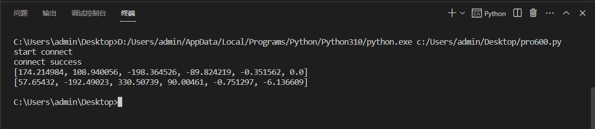

# RoboFlowSocket

[](https://img.shields.io/pypi/pyversions/RoboFlowSocket) [](https://pypi.org/project/RoboFlowSocket/) [](https://img.shields.io/github/license/elephantrobotics/RoboFlowSocket)

## Introduction
RoboFlowSocket用于控制mycobot pro 600，连接机械臂服务器进行TCP/IP通讯。   
RoboFlowSocket is used to control mycobot pro 600 and connect the robotic arm server for TCP/IP communication.
[](https://www.elephantrobotics.com/en/mycobot-600-en/)

# Installation

## pip

```
pip install RoboFlowSocket
```


输入命令检查是否安装成功

check whether the installation was successful

```
pip show RoboFlowSocket
```


# **API Interface Description**

大象机器人允许用户使用**Socket远程控制**机器人。 我们使用TCP协议在客户端和机器人之间进行通信，用户可以通过TCP发送**格式化字符串**来获取或设置机器人的某些属性/状态。
您可以在`RoboFlowSocket/README.md` 中找到RoboFlowSocket 提供了哪些接口。请转到[此处](https://github.com/elephantrobotics/RoboFlowSocket/tree/main/RoboFlowSocket/README.md)。

Elephant Robotics allow users to remotely control the robot using **Socket**. We use tcp protocol to communicate between the client and the robot, you can send **the formated string** through tcp to get or set some property/state of the robot.
You can find out which interfaces RoboFlowSocket provides in `RoboFlowSocket/README.md`.Please go to [here](https://github.com/elephantrobotics/RoboFlowSocket/tree/main/RoboFlowSocket/README.md).

# Test

```python
from RoboFlowSocket import RoboFlowSocket

# 连接机械臂服务端IP地址的端口
erobot = RoboFlowSocket()

# 开机和上电机器人
erobot.power_on()
erobot.state_on()

# 获取机械臂关节信息
cur_angles = erobot.get_angles()
print(cur_angles)

# 控制关节一走90°
angles = [90.0, -90.0, 0.0, -90.0, 0.0, 0.0]
erobot.set_angles(angles, 500)

cur_coords = erobot.get_coords()
print(cur_coords)

get_speed = erobot.get_speed()
print(get_speed)

check = erobot.check_running()
print(check)
```



# Notice

用Python调用API接口控制机械臂的时候，**server_address**要改为树莓派的IP地址，并且保证PC和树莓派在同一局域网内（即IP地址**xxx.xxx.xxx.yyy**,前三位数字一样），就可以通过Socket通信。

When using Python to control the robotic arm, the **server_address** should be changed to the IP address of the Raspberry Pi, and ensure that the PC and the Raspberry Pi are in the same LAN (the IP address **xxx.xxx.xxx.yyy**, the first three digits are the same ), you can communicate through Socket.


确保在运行前，**关节没有超过限位**，否则机械臂操作失败，关节限位请看[这里](https://github.com/elephantrobotics/RoboFlowSocket/blob/main/RoboFlowSocket/README.md#set_angles)

**Make sure that the joints do not exceed the limit before running**, otherwise the operation of the robot arm will fail. Please see here for the [joint limit](https://github.com/elephantrobotics/RoboFlowSocket/blob/main/RoboFlowSocket/README.md#set_angles)


# License
MIT License

[Copyright () 2020 Elephant Robotics](https://github.com/elephantrobotics/RoboFlowSocket/blob/main/LICENSE)

***
> [elephantrobotics.com](https://www.elephantrobotics.com/)  ·  GitHub [@elephantrobotics](https://github.com/elephantrobotics)  ·  Bilibili [@大象机器人](https://space.bilibili.com/2126215657)

